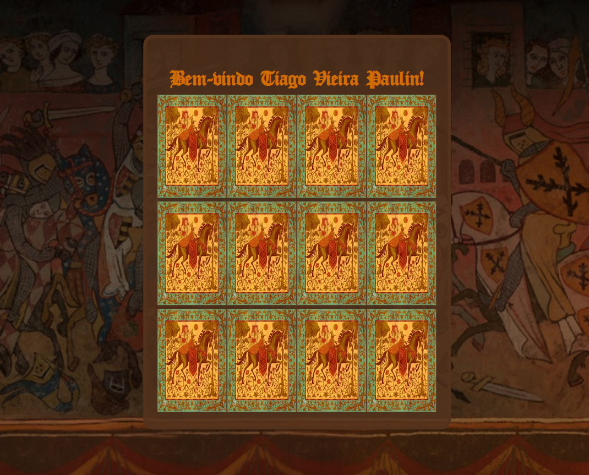
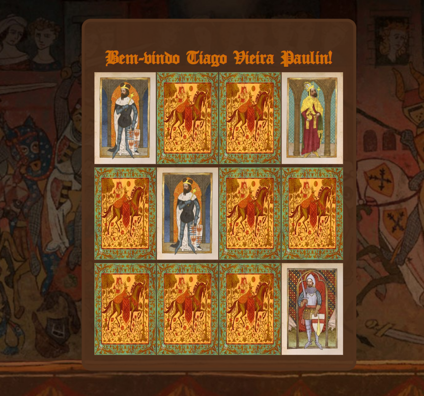

# Jogo-da-memoriaJs
Jogo da memória com temática medielval implementado utilizando HTML, CSS e JavaScript

## Como funciona a aplicação

* Ao acessar a página "index.html" será exibido para o jogador um formulario onde ele insere o seu nome e a dificuldade do jogo, sendo que a dificuldade corresponde ao número de cartas do tabuleiro.

Apos inserir o nome e selecionar a dificuldade do jogo o jogador pode clicar em "Iniciar" para começar o jogo.

* Após iniciar o jogo o formulário some e surge o tabuleiro com uma mensagem de boas-vindas ao jogador e o número de cartas escolhido por ele viradas para baixo.

* Uma vez que o jogo inicia o jogador pode revelar um par de cartas clicando nelas
- caso as cartas do par escolhido sejam iguais uma mensagem "Voce encontrou um par de cartas!" será exibida na parte de baixo do tabuleiro e a castas se manterão viradas até o fim do jogo

- caso as cartas do par escolhido sejam diferentes, após 1 segundo as cartas se virarão novamente para que o ususário tente novas possibilidades de combinação

* Quando o jogador consegue encontrar todos os pares de cartas o tabuleiro some e da lugar a um painel de vitória, onde o jogador pode voltar para tela inicial e jogar denovo clicando no botão "Reiniciar"

## Regras

* O jogador não pode iniciar o jogo sem ter inserido um nome no campo do nome

* O jogador não pode iniciar o jogo sem ter selecionado um dificuldade

* Quando o jogador selecionar a primeira carta ela deverá ficar virada até que o usuário selecione a segunda carta

